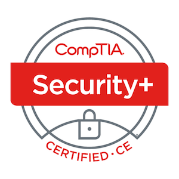
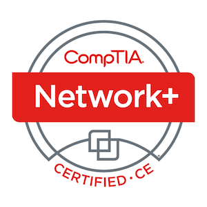
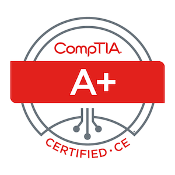
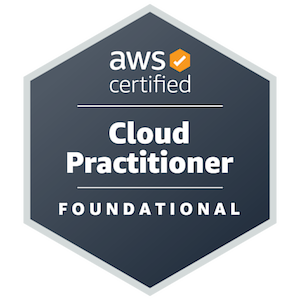
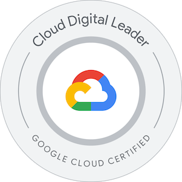

👋 Hello! 

I'm Dimitriy, an IT professional with a passion for technology and a drive to continuously learn and improve. 💻

On this site, you'll find a collection of personal projects and insightful blog posts where I share my IT learning journey and experience. I'm always eager to connect with fellow IT professionals and expand my knowledge. Let's connect! 🤝

## 🧰 Skills 

* **Operating Systems:** Windows 10/11, Windows Server, Linux
* **Cloud Computing:** AWS, Azure, GCP
* **Microsoft Technologies:** Active Directory, Microsoft 365, Entra ID, Microsoft Office Suite, SharePoint, Teams
* **Networking:** TCP/IP, DNS, DHCP, Firewalls, VPNs
* **Scripting:** PowerShell, Bash, Python
* **Troubleshooting:** Hardware, Software, Network Connectivity
* **Soft Skills:** Communication, Empathy, Active Listening, Teamwork, Problem-solving

## 🏅 Certifications 

   
   
   

   
   
   

   
   

